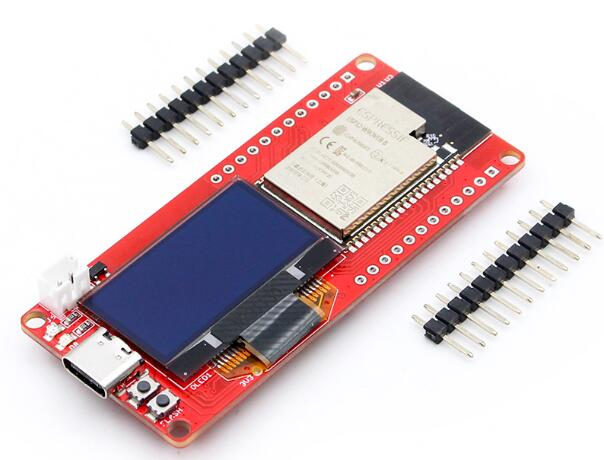
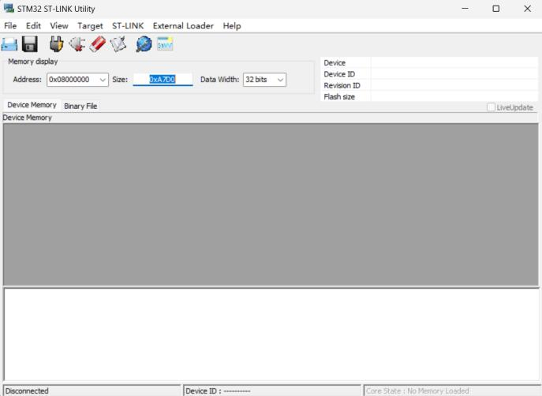
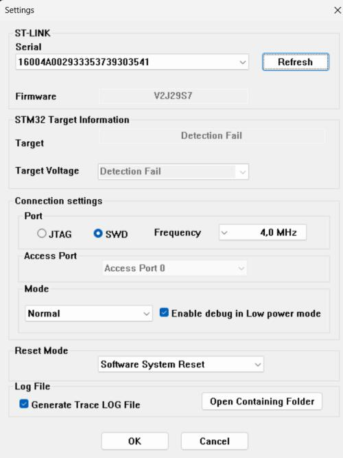
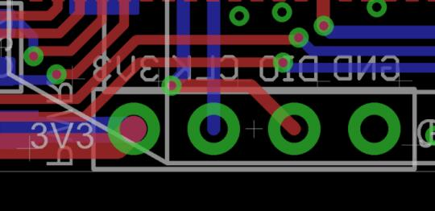
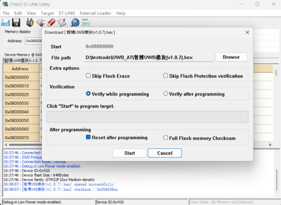
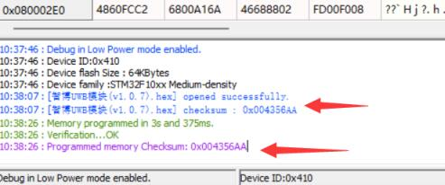

# MaUWB_DW3000 with STM32 AT Command


```

Version:    V1.2
Author:     Vincent
Create Date:    2023/10/14
Note:

    2023/10/19 V1.1: Add at command usage and hardware.
    2023/12/11 V1.2: Add a packaged position.py.


```



[toc]

# Makerfabs

[Makerfabs home page](https://www.makerfabs.com/)

[Makerfabs Wiki](https://wiki.makerfabs.com/)


# MaUWB_DW3000 with STM32 AT Command
## Intruduce

Product Link ：[MaUWB_DW3000 with STM32 AT Command](https://www.makerfabs.com/mauwb-dw3000-with-stm32-at-command.html) 

Wiki Link : []()

The latest UWB module that solves multiple anchors& tags mutual conflicts, support max 8 Anchors + 64 tags in application, to create a multi-anchor multi-tag positioning system.


## Feature

- DW3000 with PA, max range 500M
- Precision 0.5M(in range 100m)
- Support 8 anchors+ 32 Tags application

# Code

## AT Command Usage

Please refer to the AT Command manual for detailed use.

hardware\Makerfabs UWB AT Module AT Command Manual(v1.0.5).pdf


### Initial configuration

You are advised to use serial_test.ino to configure the UWB AT module.
Each time you configure the UWB AT module, follow the following configuration sequence:

```C 

AT?

//Test whether the serial port communication is normal

AT+RESTORE

//Restore factory Settings


AT+SETCFG=(x1),(x2),(x3),(x4)
// Such as: AT+SETCFG=0,1,0,1

//Set the role and frequency
//More on that later

AT+SETCAP=10,15

//Set the capacity and send time slot

AT+SETRPT=1

// Turn on automatic reporting

AT+SAVE

// Save

AT+RESTART

// Restart

```

### Set the role and frequency

AT+SETCFG=(x1),(x2),(x3),(x4)

Parameter description

x1: Device ID(Note: Base station 0-7, label 0-31)

x2: Device role (0: tag /1: base station)

x3: device air speed (0:850K/1:6.8M, default :6.8M)

x4: Range filtering enabled (0: off /1: on)

Generally, 850K is used and distance filtering is turned on.

```c
//Example
//A0
AT+SETCFG=0,1,0,1

//A1
AT+SETCFG=1,1,0,1

//A2
AT+SETCFG=2,1,0,1

//A3
AT+SETCFG=3,1,0,1

//T0
AT+SETCFG=0,0,0,1

//T1
AT+SETCFG=1,0,0,1

//T2
AT+SETCFG=2,0,0,1

//T3
AT+SETCFG=3,0,0,1

//T4
AT+SETCFG=4,0,0,1

//T5
AT+SETCFG=5,0,0,1


```


## Compiler Options

- Use type-c use cable connect USB-TTL to PC.
- Select "ESP32 DEV Module"

Libraries:
- Use 2.0.0   Wire
- Use 1.11.7   Adafruit_GFX_Library
- Use 1.14.4   Adafruit_BusIO
- Use 2.0.0   SPI
- Use 2.5.7   Adafruit_SSD1306


## Example

### esp32_at_t0

Factory firmware, reset the UWB AT module and set it to Tag 0.

### esp32_at_t0

Reset the UWB AT module and set it to Anchor 0.

### serial_test

Serial port test

### Indoor positioning

Simple indoor positioning example, using json to pass data.
You need to configure all UWB modules in advance and burn the get_range program to A0.
This program parses the AT instructions into JSON format and uploads them through the serial port.

The corresponding Python packages, such as PySerial and PyGame, need to be installed in advance.
And modify the position of several origin points in the code:

(unit cm)
```Python

A0X, A0Y = 300, 200
A1X, A1Y = 300, 300
A2X, A2Y = 0, 0
A3X, A3Y = 0, 700

```
Connect the PC with a USB cable and run the Python program.

**This code is for promotional use only and is not part of the UWB AT module product, and Makerfabs does not provide further technical support.**

**Update**

For a more convenient experience for some customers, we provide a packaged exe file. Please insert A0 configured first, and be sure to burn the get_range program.

And make sure the computer's serial port is not connected to any other devices, because this program is scanning the first COM device.

And this program has been determined to be in the range of 10 meters by 10 meters, and will be accompanied by various crashes.

We are not responsible for any technical support for this software, for reference only, only for the packaging of position.py.


# AT Module Firmware Update

Connect ST-Link to PC.

Open STM32 ST-LINK Utility.


Open "Target/Settings", it should display ST-Link Serial Number.


Close the window, back to main page.

Connect ST-Link and MaUWB.

And use TypeC cable power on MaUWB, the power of ST-Link is not enough.

Like this:

|ST-LINK|3v3|gnd|clk|dio|
|----|----|----|----|----|
|UWB_AT|3.3v|gnd|swclk|swdio|



Click "connect to target", it should be display device type. And click "Program verify".


Select hex file, click "START" to download.






# STM32 Pin Map

STM32F103RCT6

|Index|STM32|PINOUT|Function|
|----|----|----|----|
|1|PA0|DW_RSTn|Reset pin. Active Low Output.|
|2|PA4|DW_CSn|SPI chip select|
|3|PA5|DW_SLK|SPI clock|
|4|PA6|DW_MISO|SPI data output|
|5|PA7|DW_MOSI|SPI data input.|
|6|PA8|DW_EXTON|External device enable. Asserted during wake up process and held active until device enters sleep mode. Can be used to control external DC-DC converters or other circuits that are not required when the device is in sleep mode so as to minimize power consumption.|
|7|PB0|DW_wakeup|When asserted into its active high state, the WAKEUP pin brings the DW3000 out of SLEEP or DEEPSLEEP states into operational mode|
|8|PB5|DW_IRQn|Interrupt Request output from the DW3000 to the host processor. By default IRQ is an active-high output but may be configured to be active low if required. For correct operation in SLEEP and DEEPSLEEP modes it should be configured for active high operation. This pin will float in SLEEP and DEEPSLEEP states and may cause spurious interrupts unless pulled low. When the IRQ functionality is not being used the pin may be reconfigured as a general purpose I/O line, GPIO8.|
|10|PA1|LED_RUN|Indicator output pin|
|11|PA9|USART1_TX|
|12|PA10|USART1_RX|
|13|PA13|SWDIO|
|14|PA14|SWCLK|
