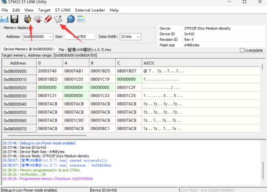

# MaUWB_DW3000 with STM32 AT Command


```c++
/*
Version:		V1.1
Author:			Vincent
Create Date:	2023/10/14
Note:

    2023/10/19 V1.1: Add at command usage and hardware.

*/
```


[toc]

# Makerfabs

[Makerfabs home page](https://www.makerfabs.com/)

[Makerfabs Wiki](https://wiki.makerfabs.com/)


# MaUWB_DW3000 with STM32 AT Command
## Intruduce

Product Link ：[MaUWB_DW3000 with STM32 AT Command](https://www.makerfabs.com/mauwb-dw3000-with-stm32-at-command.html) 

Wiki Link : []()

The latest UWB module that solves multiple anchors& tags mutual conflicts, support max 8 Anchors + 32 tags in application, to create a multi-anchor multi-tag positioning system.


## Feature

- DW3000 with PA, max range 500M
- Precision 0.5M(in range 100m)
- Support 8 anchors+ 32 Tags application

# Code

## AT Command Usage

Please refer to the AT Command manual for detailed use.

hardware\Makerfabs UWB AT Module AT Command Manual(v1.0.5).pdf


### Initial configuration

You are advised to use serial_test.ino to configure the UWB AT module.
Each time you configure the UWB AT module, follow the following configuration sequence:

```C 

AT?

//Test whether the serial port communication is normal

AT+RESTORE

//Restore factory Settings


AT+SETCFG=(x1),(x2),(x3),(x4)
// Such as: AT+SETCFG=0,1,0,1

//Set the role and frequency
//More on that later

AT+SETCAP=10,15

//Set the capacity and send time slot

AT+SETRPT=1

// Turn on automatic reporting

AT+SAVE

// Save

AT+RESTART

// Restart

```

### Set the role and frequency

AT+SETCFG=(x1),(x2),(x3),(x4)

Parameter description

x1: Device ID(Note: Base station 0-7, label 0-31)

x2: Device role (0: tag /1: base station)

x3: device air speed (0:850K/1:6.8M, default :6.8M)

x4: Range filtering enabled (0: off /1: on)

Generally, 850K is used and distance filtering is turned on.

```c
//Example
//A0
AT+SETCFG=0,1,0,1

//A1
AT+SETCFG=1,1,0,1

//A2
AT+SETCFG=2,1,0,1

//A3
AT+SETCFG=3,1,0,1

//T0
AT+SETCFG=0,0,0,1

//T1
AT+SETCFG=1,0,0,1

//T2
AT+SETCFG=2,0,0,1

//T3
AT+SETCFG=3,0,0,1

//T4
AT+SETCFG=4,0,0,1

//T5
AT+SETCFG=5,0,0,1


```


## Compiler Options

- Use type-c use cable connect USB-TTL to PC.
- Select "ESP32 DEV Module"

Libraries:
- Use 2.0.0   Wire
- Use 1.11.7   Adafruit_GFX_Library
- Use 1.14.4   Adafruit_BusIO
- Use 2.0.0   SPI
- Use 2.5.7   Adafruit_SSD1306


## Example

### esp32_at_t0

Factory firmware, reset the UWB AT module and set it to Tag 0.

### esp32_at_t0

Reset the UWB AT module and set it to Anchor 0.

### serial_test

Serial port test

### Indoor positioning

Simple indoor positioning example, using json to pass data.
You need to configure all UWB modules in advance and burn the get_range program to A0.
This program parses the AT instructions into JSON format and uploads them through the serial port.

The corresponding Python packages, such as PySerial and PyGame, need to be installed in advance.
And modify the position of several origin points in the code:

(unit cm)
```Python

A0X, A0Y = 300, 200
A1X, A1Y = 300, 300
A2X, A2Y = 0, 0
A3X, A3Y = 0, 700

```
Connect the PC with a USB cable and run the Python program.

**This code is for promotional use only and is not part of the UWB AT module product, and Makerfabs does not provide further technical support.**


# AT Module Firmware Update

Connect ST-Link to PC.

Open STM32 ST-LINK Utility.


Open "Target/Settings", it should display ST-Link Serial Number.


Close the window, back to main page.

Connect ST-Link and MaUWB.

And use TypeC cable power on MaUWB, the power of ST-Link is not enough.

Like this:

|ST-LINK|3v3|gnd|clk|dio|
|----|----|----|----|----|
|UWB_AT|3.3v|gnd|swclk|swdio|


Click "connect to target", it should be display device type. And click "Program verify".



Select hex file, click "START" to download.


